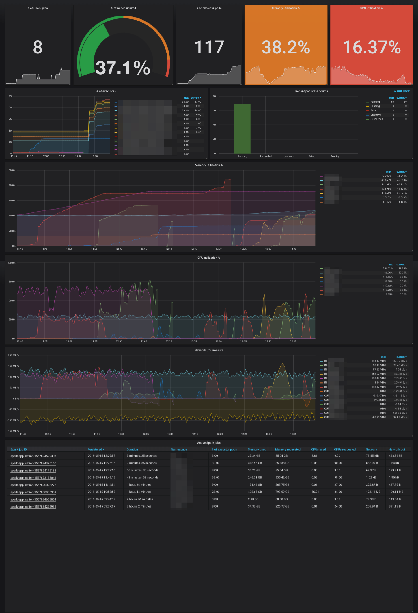

# Spark-on-k8s cluster monitoring dashboard

We know that there are admin dashboards for Spark running on standalone, YARN and Mesos clusters. However as of Spark 2.4.3, there is little visibility of Spark jobs running on Kubernetes (k8s) clusters.

This dashboard attempts to fill this missing bit.

## Setup

1. Install Prometheus stack to collect pod and node metrics (see [prometheus-operator chart](https://github.com/helm/charts/tree/master/stable/prometheus-operator))
1. Install Grafana and import `dashboard.json` into Grafana.

## What can you see?

- Count of spark jobs running in cluster
- % of nodes used
- Memory and CPU utilisation
- Network I/O pressure
- Details of active jobs

#### Accessing the Spark UIs

Click on the Spark job ID under "Active Spark jobs" table to access its respective Spark UI.

*Note: You may change the Spark UI's domain via the variable `$spark_ui_domain`*

#### How does it look like?

## How does it work?

Spark launches drivers and executor pods with a set of labels for bookkeeping purposes: https://github.com/apache/spark/blob/branch-2.4/resource-managers/kubernetes/core/src/main/scala/org/apache/spark/deploy/k8s/Constants.scala#L22

The dashboard leverages on these sets of pod labels by extracting and contextualising the associated pod and node metrics.

## Alternatives

- Banzai Cloud's Spark Metrics Prometheus Sink: https://github.com/banzaicloud/spark-metrics/blob/master/PrometheusSink.md
